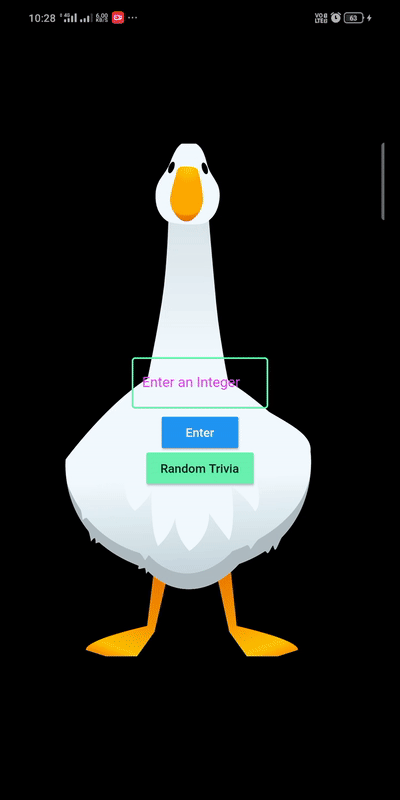

# Numphy- A Number Trivia App
#### Flutter App which gives you interesting facts about numbers.
#### Features
<h5>
<ul>
  <li>You can enter any integer to know any interesting facts about it (if exists)</li>
  <li>Cllick Random Trivia to know about any random number</li>
  <li>Rive's Guss Animation is implemented in home page, It closes it's eyes when you input something in the text field</li>
</ul>
  </h5>
  
#### Download Here
</img>
#### Number Trivia

#### Random Trivia

## Getting Started

This project is a starting point for a Flutter application.

A few resources to get you started if this is your first Flutter project:

- [Lab: Write your first Flutter app](https://flutter.dev/docs/get-started/codelab)
- [Cookbook: Useful Flutter samples](https://flutter.dev/docs/cookbook)

##### For help getting started with Flutter, view our [online documentation](https://flutter.dev/docs), which offers tutorials,samples, guidance on mobile development, and a full API reference.

